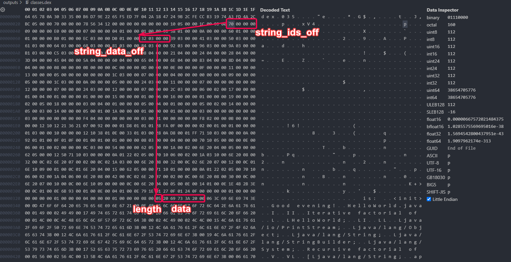

# Lab 01 - Android DEX bytecode

Our project is to write an Android bytecode decompiler in Rust.  

To understand what this means, it is helpful to compile a small Java program to Android dalvik format.

TL;DR: 

```sh
cd java
javac HelloWorld.java
d8 HelloWorld.class
d2j-dex2smali classes.dex
```

javac - from the Java Development Kit; should be JDK 21 or later  
d8 - https://developer.android.com/studio/index.html#command-line-tools-only  
dex2smali - https://github.com/pxb1988/dex2jar/releases/tag/v2.4  

The steps for compiling Java code into Android executable format are:
1) compile into Java bytecode (.class file) - this is code that can run on the regular desktop JVM
2) use Android's `d8` compiler to convert the Java bytecode to Android Dalvik bytecode (`classes.dex` file) - this is code that could be executed by the Android Runtime (ART) virtual machine on Android devices

After we have the `classes.dex` file, we can use the `dex2smali` program to "decompile" it into `Smali` syntax. Smali is an assembly-like language that ocrresponds to the binary ART/Dalvik bytecode in .dex files - similar to x86 assembly for Windows executables.

Tip: you can use the full path to executables to avoid issues with them not being in the PATH environment (shift+right click - copy as path on Windows).  

For example: 
```
"C:\Users\cvijdea\Downloads\cmdline-tools\bin\d8.bat" HelloWorld.class
"C:\Users\cvijdea\Downloads\dex-tools-v2.4\d2j-dex2smali.bat" classes.dex
```

If this doesn't work in PowerShell, try using Command Prompt (cmd.exe).

The [HelloWorld.smali](./outputs/HelloWorld.smali) file is the final result of running the above 3 commands.

## Android DEX format

Our goal is to replace the `dex2smali` tool with our own program. The first step is to understand the DEX file format, and then the format of the dalvik instructions encoded within.

- https://source.android.com/docs/core/runtime/dex-format
- https://source.android.com/docs/core/runtime/dalvik-bytecode
- https://source.android.com/docs/core/runtime/instruction-formats


While reading this documentation it might be useful to look at a .dex file in a hex viewer. The VS Code "Hex Editor" plugin is a simple viewer you can use.


As an example, in [src/main.rs](./src/main.rs) there is some code which lists all the strings out of the strings data section in the small .dex file we created in our previous step. To arrive at this code, the steps we took are:

A. Look at the [header_item](https://source.android.com/docs/core/runtime/dex-format#header-item) documentation, which describes the bytes at the start of the file. Here we can see that there are various fields before the 2 fields which are of interest to us, `string_ids_size` and `string_ids_off`. By adding up the size of the data types specified for those fields (ubyte[8] + uint + ubyte[20] + uint + uint + uint + uint + uint + uint), we can conclude that `string_ids_size` should be at position 56, followed by `string_ids_off` at 60.


After reading the dex file into memory, the simplest way to access the fields is to directly read the data at the desired index, and interpret it as an `u32` in little-endian form (the equivalent of the `uint` data type mentioned in the Android documentation).

```rust
let string_ids_size = u32::from_le_bytes(bytes[56..60].try_into().unwrap());

// the above line is equivalent to the following lines:

// get a subslice of the input data; this can panic (fail) if the input file is smaller than 60 bytes
let string_ids_size: &[u8] = &bytes[56..60];

// the subslice is of &[u8] type, which is dynamically-sized. we know it's exactly 4 bytes due to the slice index we used, 
// but the compiler doesn't know it. we need to explicitly convert the slice type into a fixed-size array type [u8; 4]
let string_ids_size: Result<[u8; 4], std::array::TryFromSliceError> = string_ids_size.try_into();

// the conversion could fail, but only if we used a wrong-size slice index, such as &bytes[56..59]
let string_ids_size: [u8; 4] = string_ids_size.unwrap();  

// now we can pass the fixed-size array to u32::from_le_bytes
let string_ids_size: u32 = u32::from_le_bytes(string_ids_size);


// You can also notice that the first line of code doesn't need any of the type annotations we used in the expanded form
// In rust, in most instances, the compiler can "guess" the types of intermediate variables based on the expected type
// Since u32::from_le_bytes takes an argument of [u8; 4], then the compiler can know which type we want to "try_into" 
//  the conversion of the initial slice, by working backwards. 
```

Continuing to read the documentation, we can see that the `string_ids_off` field represents an "offset from the start of the file to the string identifiers list [..], the start of the string_ids section", while `string_ids_size` is the number of elements in the string_ids section. Looking at the definition of a `string_id_item` we can see that it is composed of a single uint value - string_data_off.

So, at the position indicated by `string_ids_off`, we can read an uint value `string_ids_size`, and each of these values is an "offset from the start of the file to the string data [..] in the format specified by string_data_item" - in effect, this is an array of "pointers" to the actual strings we are looking for.

Then, by looping through these values we can read the `utf16_size` (length) and `data` fields of each string. The length field is in `uleb128` format, which is a dynamic way of writing number - small numbers occupy a single byte, while bigger numbers occupy multiple bytes. We need to decode the uleb format to know where the number ends and the string data begins. 

Note that the provided code is not completely correct in how it reads data - can you spot the error?



Try to understand the provided code, and the rust concepts used in it:

- https://doc.rust-lang.org/book/ch19-03-pattern-syntax.html
- https://doc.rust-lang.org/std/primitive.u32.html#method.from_le_bytes
- https://doc.rust-lang.org/rust-by-example/types/inference.html
- https://doc.rust-lang.org/book/ch08-02-strings.html
